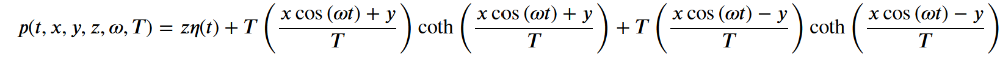
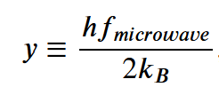
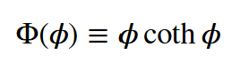
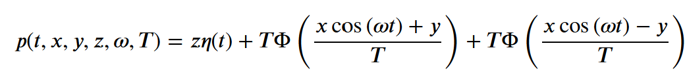
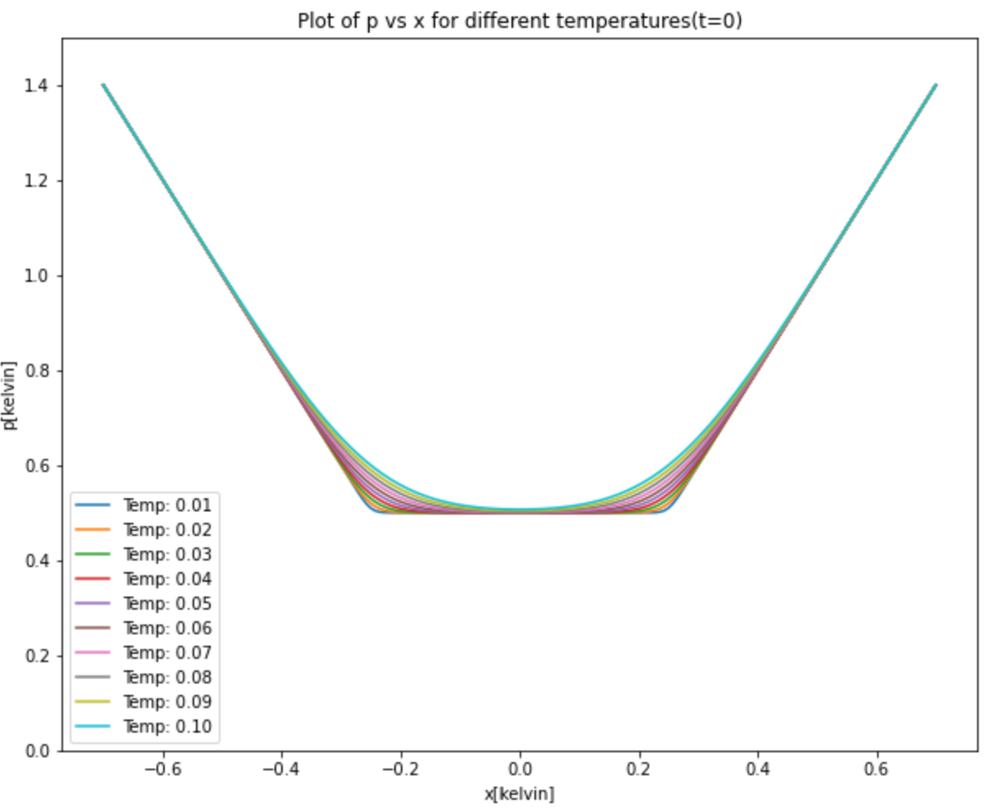
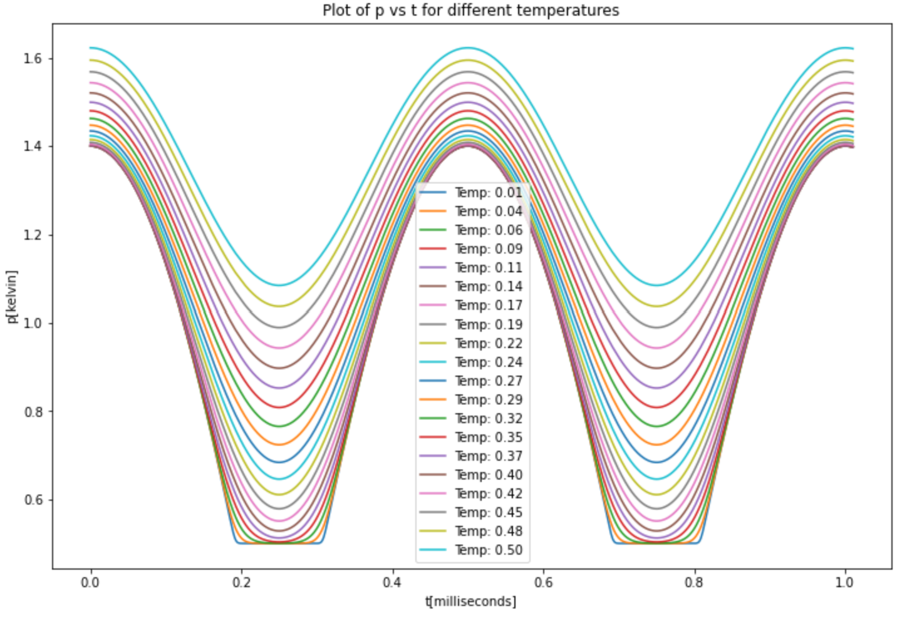
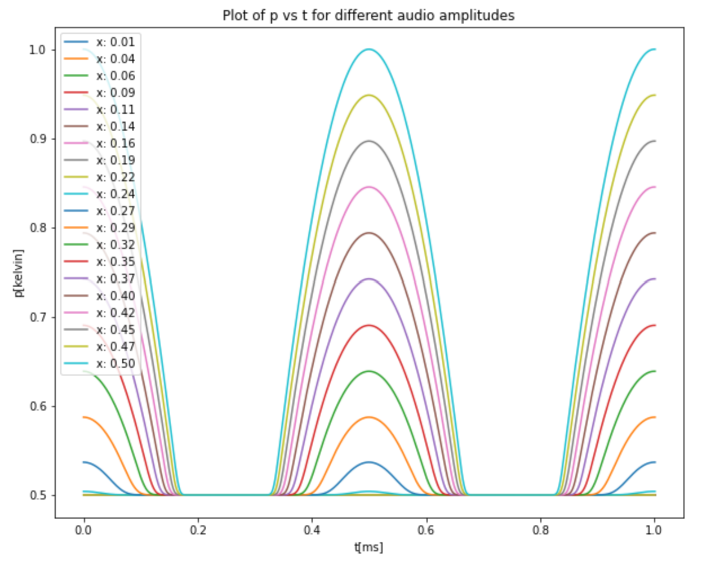
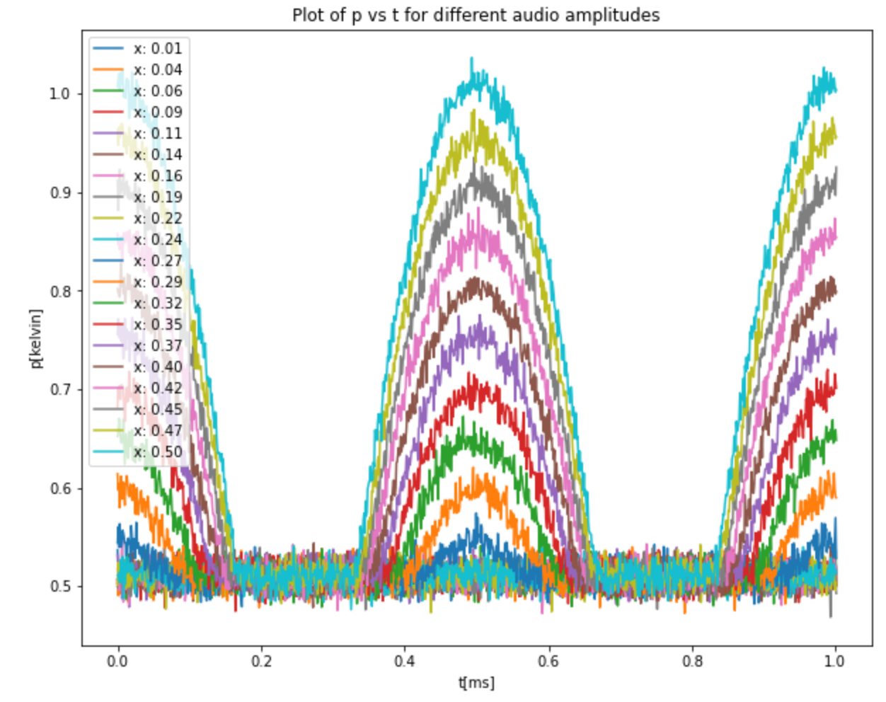
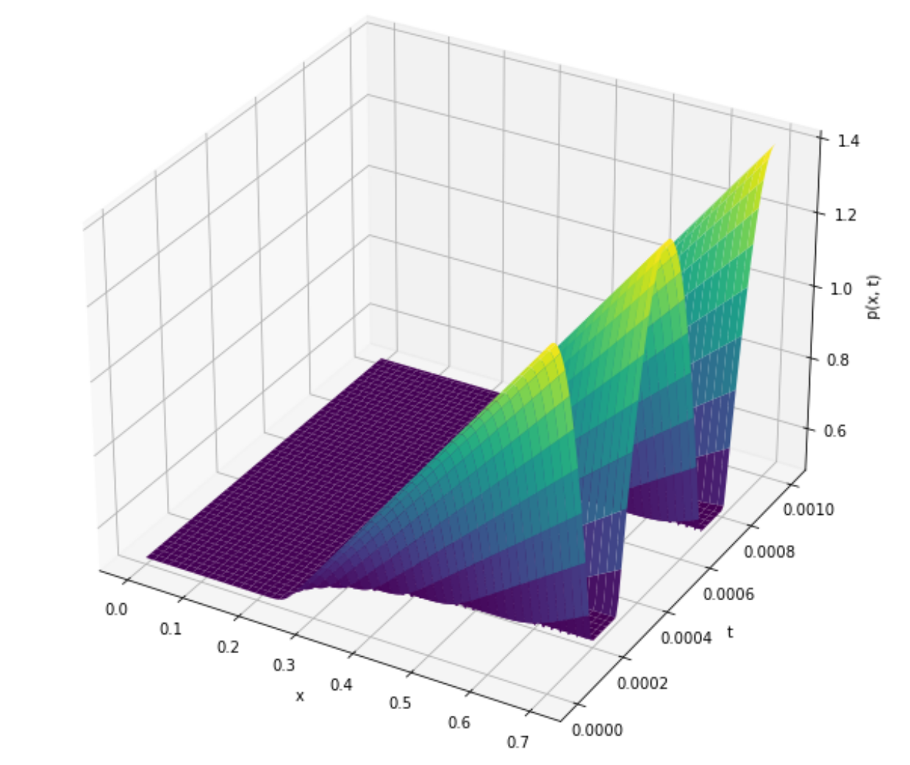
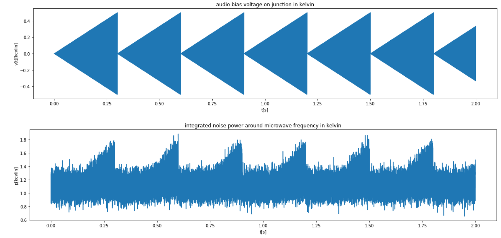

# Quantum Noise Synth

Consider a quantum tunnel junction. An audio(20 Hz to 20 kHz) cosine signal of angular frequency omega = 2 pi*f_audio and amplitude x in kelvin units is applied to the junction.  The integrated noise power around some microwave frequency is measured and converted to an output power in kelvin units referenced to the plane of the junction.  This output power is called p and is measured in units of kelvin:

